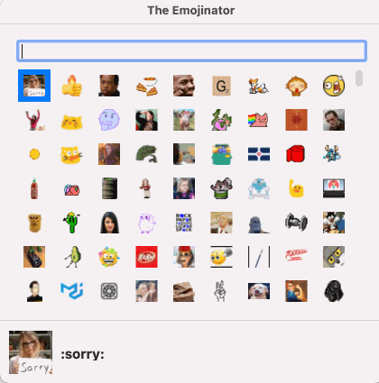
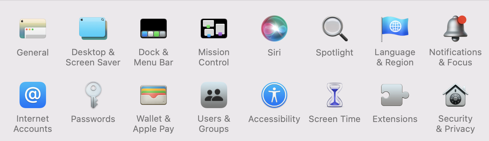
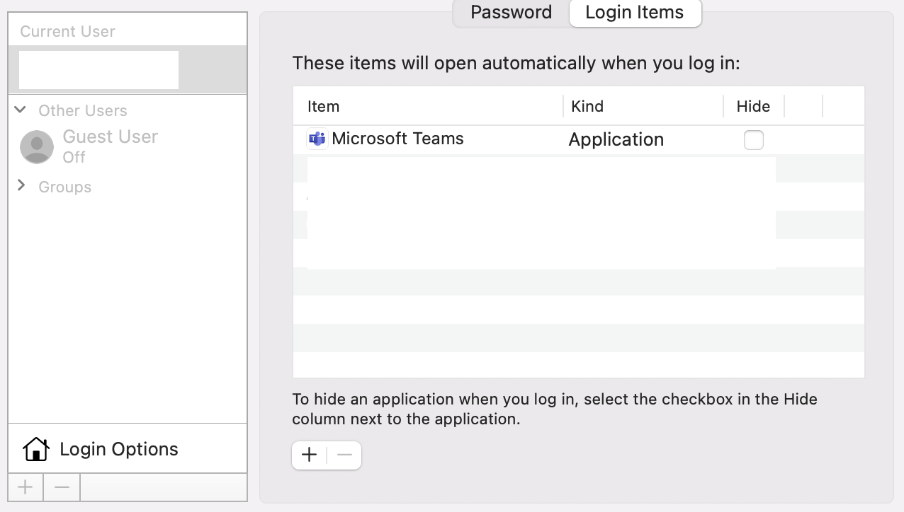

# The Emojinator
Make Microsoft Teams suck just a bit less. Use custom emoji in your MS Teams channels and chats.

 

 

## Installation & Launch

The latest release can be found [here](https://github.com/jkdufair/emojinator-macos/releases).
- Download TheEmojinator.zip
- Unzip
- Right click on "The Emojinator" and select "open". Allow the app to run if you are presented with any warnings.
- If you want The Emojinator to run after rebooting, add The Emojinator to your "Login Items" in System Preferences

 

## Usage

### To Quit
Right click on the dumpster icon in your menu bar and choose, well, "Quit"

### Choosing and Using Emojis
- Bring up the Emoji chooser with Command-Shift-Enter
- Filter emojis by typing in the text box
- Choose an Emoji
  - Navigate to the emoji you want with your arrow keys and press enter
  - Or click on the emoji you want
  - Teams will be brought to the front. Then just paste with Command-V
- Press the escape key to close the window without selecting an emoji

### Using Different Emoji Sizes

Hold down one of the following modifier keys when selecting an emoji to choose a larger size:

- No modifier: 24px
- Control: 36px
- Option: 48px
