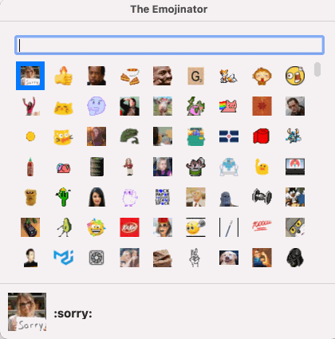

# The Emojinator
Make Microsoft Teams suck just a bit less. Use custom emoji in your MS Teams channels and chats.

 

 

## Installation & Launch

The latest release can be found [here](https://github.com/jkdufair/emojinator-macos/releases).
- Download The Emojinator.zip and unzip it
- Drag "The Emojinator" into your Applications folder
- Double-click it. The app is signed and notarized, so no security warnings should appear. A dumpster icon appears in your menu bar.
- To have it start after a reboot, open System Settings > General > Login Items & Extensions and add The Emojinator under "Open at Login"

### First-use permissions

The first time you pick an emoji, macOS asks for two permissions. Approve both, or the emoji lands on your clipboard but is not pasted into Teams:

- **Automation**: "The Emojinator" wants access to control "System Events". Click Allow.
- **Accessibility**: needed so the app can click Paste in Teams' Edit menu. Open System Settings > Privacy & Security > Accessibility and switch on The Emojinator.

## Usage

### To Quit
Right click on the dumpster icon in your menu bar and choose, well, "Quit"

### Choosing and Using Emojis
- Click in the Teams message box where you want the emoji
- Bring up the Emoji chooser with Command-Shift-Enter
- Filter emojis by typing in the text box
- Choose an Emoji
  - Navigate to the emoji you want with your arrow keys and press enter
  - Or click on the emoji you want
  - Teams is brought to the front and the emoji is pasted into your message
- Press the escape key to close the window without selecting an emoji

### Using Different Emoji Sizes

Hold down one of the following modifier keys when selecting an emoji to choose a larger size:

- No modifier: 24px
- Control: 36px
- Option: 48px

### Copying the Emoji URL to the clipboard

Hold down Command when pressing Enter to copy the URL of the emoji to the clipboard for pasting into, i.e. GitLab custom emojis
